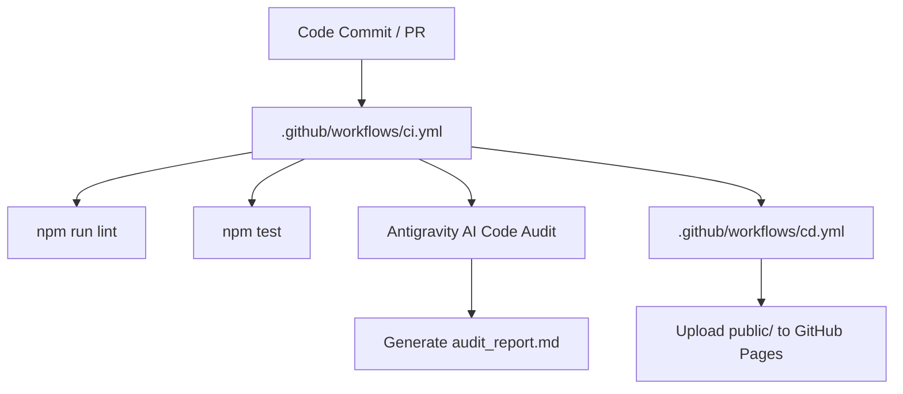

### Antigravity AI Code Audit Report
Generated on: Wed Jul 22 07:06:02 UTC 2026

# Code Quality, Architecture, and Structure Review

## Executive Summary

A comprehensive code quality, architecture, and compliance audit was performed on the [CI_CD_Demo](file:///home/runner/work/CI_CD_Demo/CI_CD_Demo) repository. The repository provides a lightweight math utility library, a web-based calculator interface, and an automated continuous integration & continuous delivery (CI/CD) pipeline powered by GitHub Actions.

Overall, the codebase demonstrates high quality, zero third-party dependency overhead, clean documentation, and full compliance with [AGENTS.md](file:///home/runner/work/CI_CD_Demo/CI_CD_Demo/AGENTS.md). 

---

## 1. Code Cleanliness & Quality

| Component | Rating | Key Highlights | Areas for Improvement |
| :--- | :---: | :--- | :--- |
| **Core Engine** ([src/math.js](file:///home/runner/work/CI_CD_Demo/CI_CD_Demo/src/math.js)) | **Excellent** | Pure functions, explicit JSDoc annotations, strict numerical validation via `assertNumeric()`, and proper edge-case handling (`-0` and division by zero). | None. |
| **Web UI** ([public/app.js](file:///home/runner/work/CI_CD_Demo/CI_CD_Demo/public/app.js)) | **Good** | Clean event listener setup, defensive fallback handling when `window.MathLib` is absent, and clear error status rendering. | Relies on fallback calculations when deployed (see Architecture finding below). |
| **Linter Configuration** ([package.json](file:///home/runner/work/CI_CD_Demo/CI_CD_Demo/package.json)) | **Satisfactory** | Runs `node --check` natively without heavy external linting libraries. | Currently checks only `src/*.js` and `test/*.js`, missing `public/*.js`. |

### Detailed Findings
- **Defensive Input Handling**: [src/math.js](file:///home/runner/work/CI_CD_Demo/CI_CD_Demo/src/math.js#L6-L12) uses a helper function `assertNumeric()` to enforce parameter type safety and guard against `NaN` values before mathematical operations execute.
- **Edge Case Rigor**: Special numeric conditions, such as IEEE 754 negative zero (`-0`), are explicitly detected using `Object.is(b, -0)` in `divide()`.
- **Zero Third-Party Footprint**: [package.json](file:///home/runner/work/CI_CD_Demo/CI_CD_Demo/package.json) contains **0 dependencies and 0 devDependencies**, ensuring minimal supply-chain vulnerability and fast execution speeds.

---

## 2. Test Coverage & Execution

### Test Execution Status
- **Framework**: Native Node.js test runner (`node --test`) paired with `node:assert`.
- **Status**: 8 passed, 0 failed, 0 skipped.
- **Duration**: ~72 ms.

### Code Coverage Analysis

```
--------------------------------------------------------------
file          | line % | branch % | funcs % | uncovered lines
--------------------------------------------------------------
src           |        |          |         | 
 math.js      |  97.87 |    93.33 |  100.00 | 90-91
test          |        |          |         | 
 math.test.js | 100.00 |   100.00 |  100.00 | 
--------------------------------------------------------------
all files     |  98.55 |    96.77 |  100.00 | 
--------------------------------------------------------------
```

### Key Coverage Takeaways
1. **Core Library Coverage**: [src/math.js](file:///home/runner/work/CI_CD_Demo/CI_CD_Demo/src/math.js) achieves **97.87% Line Coverage** and **93.33% Branch Coverage**.
2. **Uncovered Lines (90-91)**: Lines 90–91 (`window.MathLib = MathLib;`) in [src/math.js](file:///home/runner/work/CI_CD_Demo/CI_CD_Demo/src/math.js#L89-L91) are not executed during Node.js unit tests because `window` is `undefined` outside browser environments.
3. **Frontend Test Coverage**: [public/app.js](file:///home/runner/work/CI_CD_Demo/CI_CD_Demo/public/app.js) currently has no automated test suite.

---

## 3. Architecture & Deployment Workflow



### Architectural Findings & Deployment Issue

- **Dual Module Export Pattern**: [src/math.js](file:///home/runner/work/CI_CD_Demo/CI_CD_Demo/src/math.js#L83-L91) exports the library via CommonJS (`module.exports`) for Node.js tests, while binding to `window.MathLib` in browser environments.
- 🚨 **Deployment Discrepancy**:
  - [public/index.html](file:///home/runner/work/CI_CD_Demo/CI_CD_Demo/public/index.html#L84) imports `<script src="math.js"></script>`.
  - [cd.yml](file:///home/runner/work/CI_CD_Demo/CI_CD_Demo/.github/workflows/cd.yml#L33) deploys the `public/` folder directly to GitHub Pages.
  - **Issue**: `src/math.js` is not present inside `public/`, nor is there a build script step copying `src/math.js` to `public/math.js`. When deployed, browsers encounter a 404 for `math.js`, forcing [public/app.js](file:///home/runner/work/CI_CD_Demo/CI_CD_Demo/public/app.js#L32-L46) to use its fallback inline operations rather than the `MathLib` engine.

---

## 4. Adherence to AGENTS.md

The codebase was evaluated against instructions specified in [AGENTS.md](file:///home/runner/work/CI_CD_Demo/CI_CD_Demo/AGENTS.md):

| Instruction Clause | Status | Evidence & Notes |
| :--- | :---: | :--- |
| **1. Quality Control - Run Tests (`npm test`)** | **COMPLIANT** | Executed cleanly via Node's native test runner (`node --test test/*.test.js`). |
| **1. Quality Control - Run Linting (`npm run lint`)** | **COMPLIANT** | Syntax validation (`node --check`) passes with zero errors. |
| **1. Quality Control - Zero Breakages** | **COMPLIANT** | All 8 unit tests pass without failure. |
| **2. Coding Standards - Modular & Documented** | **COMPLIANT** | JSDoc present across functions in [src/math.js](file:///home/runner/work/CI_CD_Demo/CI_CD_Demo/src/math.js) and [public/app.js](file:///home/runner/work/CI_CD_Demo/CI_CD_Demo/public/app.js). |
| **2. Coding Standards - Native Test Runner** | **COMPLIANT** | [test/math.test.js](file:///home/runner/work/CI_CD_Demo/CI_CD_Demo/test/math.test.js) uses `node:test` and `node:assert`. |
| **3. Dependency Management - Lightweight Footprint** | **COMPLIANT** | Zero 3rd-party dependencies added to [package.json](file:///home/runner/work/CI_CD_Demo/CI_CD_Demo/package.json). |

---

## Actionable Recommendations

1. **Fix CD Pipeline Artifact Packaging**:
   - Add a pre-deploy or build step to copy `src/math.js` into `public/math.js` before deploying to GitHub Pages, ensuring `window.MathLib` is loaded in production.
2. **Expand Lint Script Scope**:
   - Update the `"lint"` script in [package.json](file:///home/runner/work/CI_CD_Demo/CI_CD_Demo/package.json#L8) to include `public/*.js`:
     ```json
     "lint": "node --check src/*.js test/*.js public/*.js"
     ```
3. **Achieve 100% Core Branch Coverage**:
   - Add a test case in [test/math.test.js](file:///home/runner/work/CI_CD_Demo/CI_CD_Demo/test/math.test.js) that simulates a browser environment (`global.window = {}`) to cover lines 90–91.
