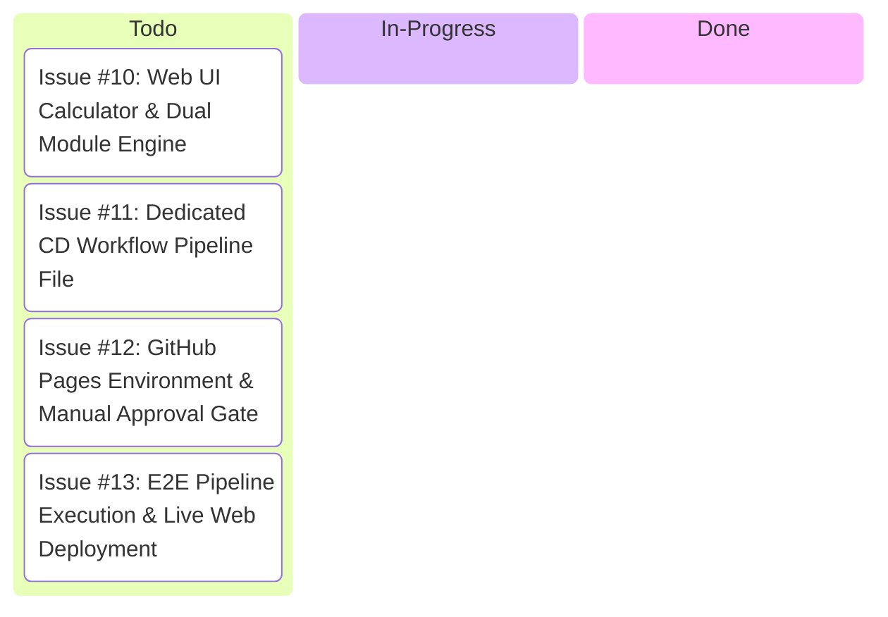

# 📋 GitHub Project Kanban Board: Continuous Delivery Pipeline

This interactive issue board tracks the real-time progress of all tasks required to implement Continuous Delivery (CD) for the `CI_CD_Demo` project.

---

## 🚦 Kanban Board Status

---

## 📋 Real GitHub Issues Created (All initially in To-Do State)

### 🔴 [GitHub Issue #10](https://github.com/CEME-DC-SE/CI_CD_Demo/issues/10) - Web UI Calculator & Dual Module Engine
*   **Status**: `TO-DO` ⏳
*   **Target Branch**: `feature/cd-web-ui`
*   **Description**: Upgrade `src/math.js` to support browser ES modules and CommonJS (`node:test`) simultaneously. Build modern interactive web interface (`public/index.html`, `public/style.css`, `public/app.js`).
*   **Linked Commits**: Pending
*   **Linked PR**: Pending

---

### 🔴 [GitHub Issue #11](https://github.com/CEME-DC-SE/CI_CD_Demo/issues/11) - Dedicated CD Workflow File (`.github/workflows/cd.yml`)
*   **Status**: `TO-DO` ⏳
*   **Target Branch**: `feature/cd-workflow`
*   **Description**: Implement `.github/workflows/cd.yml` with `build-and-package-site` and `deploy-production` jobs using `actions/configure-pages`, `actions/upload-pages-artifact`, and `actions/deploy-pages`.
*   **Linked Commits**: Pending
*   **Linked PR**: Pending

---

### 🔴 [GitHub Issue #12](https://github.com/CEME-DC-SE/CI_CD_Demo/issues/12) - GitHub Pages Configuration & Manual Approval Gate
*   **Status**: `TO-DO` ⏳
*   **Target Branch**: `feature/cd-pages-config`
*   **Description**: Document and configure repository environment rules (`github-pages` environment with manual approval gate) and set GitHub Actions as Pages source.
*   **Linked Commits**: Pending
*   **Linked PR**: Pending

---

### 🔴 [GitHub Issue #13](https://github.com/CEME-DC-SE/CI_CD_Demo/issues/13) - E2E Pipeline Execution & Live Verification
*   **Status**: `TO-DO` ⏳
*   **Target Branch**: `feature/cd-e2e-verification`
*   **Description**: Merge feature branches to `main`, trigger CD pipeline, grant manual deployment approval, and verify live web deployment at `https://<username>.github.io/CI_CD_Demo/`.
*   **Linked Commits**: Pending
*   **Linked PR**: Pending
