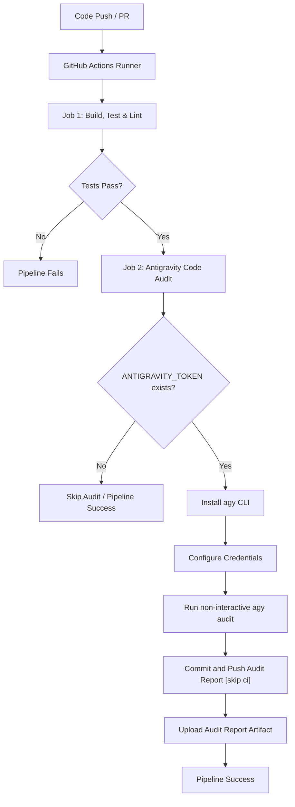

# Antigravity CI/CD Integration & Configuration Guide

This guide details how to configure a Continuous Integration (CI) and Continuous Delivery/Deployment (CD) pipeline utilizing the **Antigravity CLI (`agy`)**.

---

## 1. Workflow Architecture

The diagram below illustrates how standard build-and-test steps run alongside the automated Antigravity AI Code Audit:



---

## 2. CI/CD Files Configured

The following configurations are placed at the root of the project:
1. **[.github/workflows/ci.yml](./.github/workflows/ci.yml)**: The GitHub Actions configuration file.
2. **[AGENTS.md](./AGENTS.md)**: Contains rules and execution policies for the AI agent inside the workspace.

### GitHub Actions YAML

Below is the workflow code defined in [.github/workflows/ci.yml](./.github/workflows/ci.yml):

```yaml
name: CI/CD Pipeline with Antigravity Agent

on:
  push:
    branches: [ "main" ]
  pull_request:
    branches: [ "main" ]

jobs:
  build-and-test:
    name: Build, Test & Lint
    runs-on: ubuntu-latest

    steps:
      - name: Checkout Code
        uses: actions/checkout@v6

      - name: Set up Node.js
        uses: actions/setup-node@v6
        with:
          node-version: 24

      - name: Install Dependencies
        run: npm install

      - name: Run Linter
        run: npm run lint

      - name: Run Tests
        run: npm test

  antigravity-audit:
    name: Antigravity Code Audit
    needs: build-and-test
    runs-on: ubuntu-latest
    permissions:
      contents: write
    env:
      ANTIGRAVITY_TOKEN: ${{ secrets.ANTIGRAVITY_TOKEN }}
    
    steps:
      - name: Checkout Code
        uses: actions/checkout@v6
        with:
          ref: ${{ github.event.pull_request.head.ref || github.ref }}

      - name: Install Antigravity CLI
        if: ${{ env.ANTIGRAVITY_TOKEN != '' }}
        run: |
          curl -fsSL https://antigravity.google/cli/install.sh | bash
          echo "$HOME/.local/bin" >> $GITHUB_PATH

      - name: Configure Credentials
        if: ${{ env.ANTIGRAVITY_TOKEN != '' }}
        run: |
          mkdir -p $HOME/.gemini/antigravity-cli
          printf '{"token":{"access_token":"","token_type":"Bearer","refresh_token":"%s","expiry":"0001-01-01T00:00:00Z"},"auth_method":"consumer"}\n' "$ANTIGRAVITY_TOKEN" > $HOME/.gemini/antigravity-cli/antigravity-oauth-token
          chmod 600 $HOME/.gemini/antigravity-cli/antigravity-oauth-token

      - name: Run Automated Audit
        if: ${{ env.ANTIGRAVITY_TOKEN != '' }}
        run: |
          echo "### Antigravity AI Code Audit Report" > audit_report.md
          echo "Generated on: $(date)" >> audit_report.md
          echo "" >> audit_report.md
          agy --print "Perform a code quality, architecture, and structure review on the repository. Highlight code cleanliness, test coverage, and adherence to AGENTS.md instructions. Format the output in Markdown." --dangerously-skip-permissions >> audit_report.md

      - name: Commit and Push Audit Report
        if: ${{ env.ANTIGRAVITY_TOKEN != '' }}
        env:
          TARGET_REF: ${{ github.event.pull_request.head.ref || github.ref_name }}
        run: |
          git config --global user.name "github-actions[bot]"
          git config --global user.email "github-actions[bot]@users.noreply.github.com"
          git add audit_report.md
          git diff-index --quiet HEAD || git commit -m "docs: update Antigravity AI Code Audit Report [skip ci]"
          git push origin HEAD:refs/heads/"$TARGET_REF"

      - name: Upload Audit Report
        if: ${{ env.ANTIGRAVITY_TOKEN != '' }}
        uses: actions/upload-artifact@v7
        with:
          path: audit_report.md
          archive: false
```

> [!IMPORTANT]
> The `--dangerously-skip-permissions` flag is critical here. Since the agent executes commands autonomously inside the runner, it would otherwise halt the workflow waiting for interactive human approval.

---

## 3. Configuration & Authentication Details

### A. Environment Variables
Because CI environments cannot display a browser window for Google Sign-In, the CLI uses:
* **`ANTIGRAVITY_TOKEN`**: A persistent machine token generated from the Antigravity developer dashboard.

> [!CAUTION]
> Treat the `ANTIGRAVITY_TOKEN` as a high-security credential. Never hardcode it directly into your YAML workflow file. Instead, save it as a **GitHub Actions Secret** (`secrets.ANTIGRAVITY_TOKEN`).

### B. Headless Execution Flags
When running `agy` programmatically or inside workflows, use the following options:
* **`-p` or `--print`**: Runs a single prompt non-interactively and prints the response to stdout.
* **`--dangerously-skip-permissions`**: Instructs the agent to automatically approve all permission prompts (e.g. read/write files or execute commands).

---

## 4. Local Validation

Before pushing your changes, you can validate the code and formatting locally using:
* **Run Tests**: `npm test` (uses [test/math.test.js](./test/math.test.js))
* **Run Linter**: `npm run lint` (uses Node's native compiler `--check` to verify syntax)

---

## 5. How Tests and Linting Work Under the Hood

### A. Test Execution & Discovery
When you run `npm test`, it calls Node's native test runner (`node --test test/*.test.js`):
1. **Runner Invocation:** Node.js executes the built-in test runner without needing third-party testing frameworks.
2. **File Discovery:** The glob pattern `test/*.test.js` matches and runs all test suites located in the `test/` directory.
3. **Execution:** Assertions defined using `node:assert` are evaluated, returning success (`✔`) or descriptive failure logs.

### B. Linter & Syntax Checking
When you run `npm run lint`, it runs `node --check src/*.js test/*.js`:
1. **Compilation Check:** The `--check` flag compile-checks the JavaScript files to catch syntax errors without executing the code.
2. **Path Discovery:** It checks all `.js` files in `src/` and `test/` folders.
